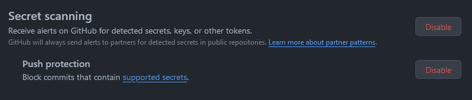

2024 年 2 月 29 日に GitHub は，ソースコード内に埋め込まれたシークレット情報を検出するための機能である Secret Scan をデフォルトで有効にすると発表しました[^1]．

[^1]: [Keeping secrets out of public repositories](https://github.blog/2024-02-29-keeping-secrets-out-of-public-repositories/)

## Secret Scanとは

リポジトリのコード内に埋め込まれたシークレット情報を検出する機能です．
検出された際に，通知を送信できるほか，プッシュされた際にシークレットが含まれている場合，プッシュの阻止も可能です．

Organization が GitHub Enterprise を利用している場合にのみ，GitHub Advanced Security を追加して，プライベートリポジトリからシークレットの漏洩を検出できるようです．

## 設定方法

手動で設定する場合は，リポジトリの Settings > Code security and analysis > Secret scanning で有効にできます．
私の検証用のリポジトリでは，デフォルトで有効になっていなかったため，手動で有効にしました．


## 検証

検証用リポジトリに，シークレット情報を含むコードをプッシュしてみました．もちろん値はダミーですよ．

push できてしまいました... ([該当コミット](https://github.com/vinyl-umbrella/playground/commit/78f7977e73fc6da8d91c056b85067cc1a1133576))

クレデンシャルと認識されなかったのかと悩み，[ドキュメント](https://docs.github.com/ja/code-security/secret-scanning/secret-scanning-patterns#supported-secrets) を見ると，サポートされているシークレットの種類が限られているようです．
また，Enterprise の場合は，一部のサービスのトークンには [有効性チェック](https://docs.github.com/ja/enterprise-cloud@latest/code-security/secret-scanning/secret-scanning-patterns#supported-secrets) も行われるようです．

ドキュメントが更新されていないだけかもしれないと思い，AWS の有効なクレデンシャルを含むコードをプッシュしてみました！
ちゃんと push できずにブロックされました！

```
❯ git push origin HEAD
Enumerating objects: 9, done.
Counting objects: 100% (9/9), done.
Delta compression using up to 20 threads
Compressing objects: 100% (3/3), done.
Writing objects: 100% (5/5), 449 bytes | 449.00 KiB/s, done.
Total 5 (delta 1), reused 0 (delta 0), pack-reused 0
remote: Resolving deltas: 100% (1/1), completed with 1 local object.
remote: error: GH013: Repository rule violations found for refs/heads/main.
remote: Review all repository rules at http://github.com/vinyl-umbrella/playground/rules?ref=refs%2Fheads%2Fmain
remote:
remote: - GITHUB PUSH PROTECTION
remote:   ——————————————————————————————————————————————————————
remote:    Resolve the following secrets before pushing again.
remote:
remote:    (?) Learn how to resolve a blocked push
remote:    https://docs.github.com/code-security/secret-scanning/pushing-a-branch-blocked-by-push-protection
remote:
remote:
remote:   —— Amazon AWS Access Key ID ——————————————————————————
remote:    locations:
remote:      - commit: 530e49bace6618aad9879ecfceb639cd9ae3586c
remote:        path: etc/secret-scan/env:1
remote:
remote:    (?) To push, remove secret from commit(s) or follow this URL to allow the secret.
remote:    https://github.com/vinyl-umbrella/playground/security/secret-scanning/unblock-secret/2dToAHHLzAQAfT6mCwkJUUw85Hm
remote:
remote:
remote:   —— Amazon AWS Secret Access Key ——————————————————————
remote:    locations:
remote:      - commit: 530e49bace6618aad9879ecfceb639cd9ae3586c
remote:        path: etc/secret-scan/env:2
remote:
remote:    (?) To push, remove secret from commit(s) or follow this URL to allow the secret.
remote:    https://github.com/vinyl-umbrella/playground/security/secret-scanning/unblock-secret/2dToAC3qFSwmok5ngkHyFouLuGo
remote:
To github.com:vinyl-umbrella/playground.git
 ! [remote rejected] HEAD -> main (push declined due to repository rule violations)
error: failed to push some refs to 'github.com:vinyl-umbrella/playground.git'
```

## まとめ

GitHub には，2024 年の初めの 8 週間で 100 万ものシークレットが push されていることを検出しているようです．
クレデンシャルの漏洩を防ぐために，[git-secrets](https://github.com/awslabs/git-secrets) といったツールを利用することが多かったです．
しかし，ツールの導入を忘れたり，そもそもツールの存在を知らない人もいるでしょう．

今回の GitHub の Secret Scan のデフォルト有効化により，CWE-798: Use of Hard-coded Credentials を減らせる世界になることを期待します．
