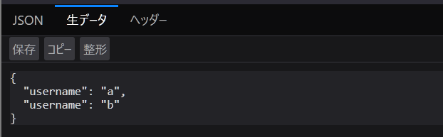
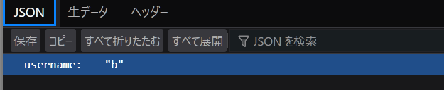

[Flatt Security Developers' Quiz #6](https://blog.flatt.tech/entry/2312giraffe_x_quiz)
を先月にやりました．

そこで，JSON のパーサの挙動について気になり，調べたのでメモを残しておきます．

## JSON

まず，[RFC8259](https://datatracker.ietf.org/doc/html/rfc8259) によると，JSON においてキーのユニークは MUST ではなく，SHOULD ですと．

> The names within an object SHOULD be unique.

また，キーが重複しているときの挙動は実装次第という感じです．

> Many implementations report the last name/value pair only. Other implementations report an error or fail to parse the object, and some implementations report all of the name/value pairs, including duplicates.

このことから，JSON のパーサの挙動の違いに基づいた脆弱性が Flatt のクイズでした．
忘備録として，いくつかの言語の JSON パーサの挙動を調査し，ここにまとめておきます．

## 実験

### JavaScript / Node.js (JSON)

```jsx
JSON.parse('{"username": "a", "username": "b"}'); // {username: "b"}
```

### Python (json)

```python
import json

json.loads('{"username": "a", "username": "b"}') # {'username': 'b'}
```

### Go (encoding/json)

```go
package main

import (
	"encoding/json"
	"fmt"
)

type User struct {
	Username string `json:"username"`
}

func main() {
	j := []byte(`{"username": "a", "username": "b"}`)
	user := User{}

	json.Unmarshal(j, &user)
	fmt.Println(user.Username) // b
}
```

### Go (github.com/buger/jsonparser)

```go
package main

import (
	"fmt"

	"github.com/buger/jsonparser"
)

type User struct {
	Username string `json:"username"`
}

func main() {
	j := []byte(`{"username": "a", "username": "b"}`)
	username, _ := jsonparser.GetString(j, "username")
	fmt.Println(username) // a
}
```

### Ruby (json)

```ruby
require "json"

j = '{"username": "a", "username": "b"}'
puts JSON.parse(j)["username"] # b
```

### jq

```sh
echo '{"username": "a", "username": "b"}' | jq '.username' # "b"
```

### Firefox の JSON Viewer

元データ

整形済み


## まとめ

個人的に触れる機会の多いものを見てみましたが，多くは last match のものを返す実装をしているようです．

実装時やテストの際には，この挙動を意識しておくとよいかもしれません．

---

- first match のもの
  - go (github.com/buger/jsonparser)
- last match のもの
  - JavaScript / Node.js (JSON)
  - Python (json)
  - Go (encoding/json)
  - Ruby (json)
  - jq
  - Firefox の JSON Viewer
