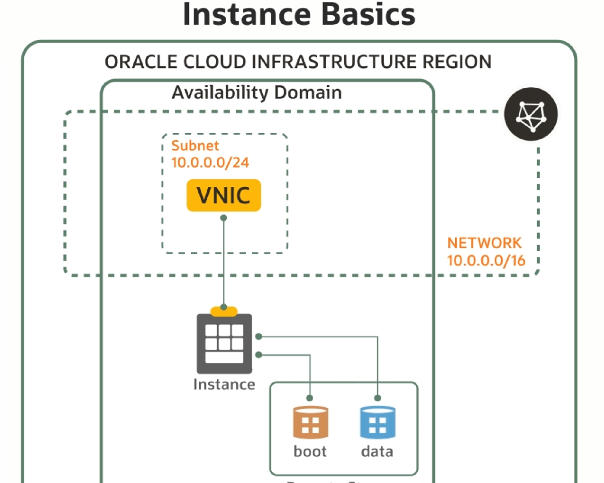
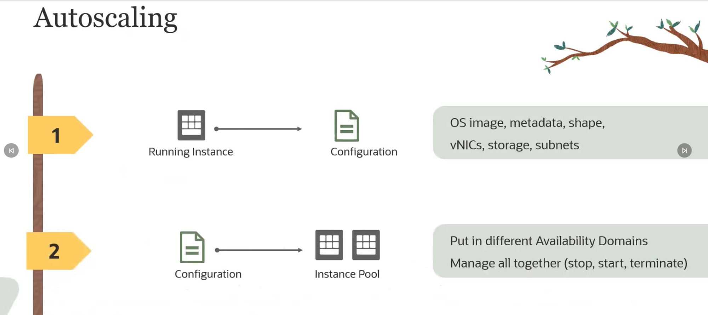
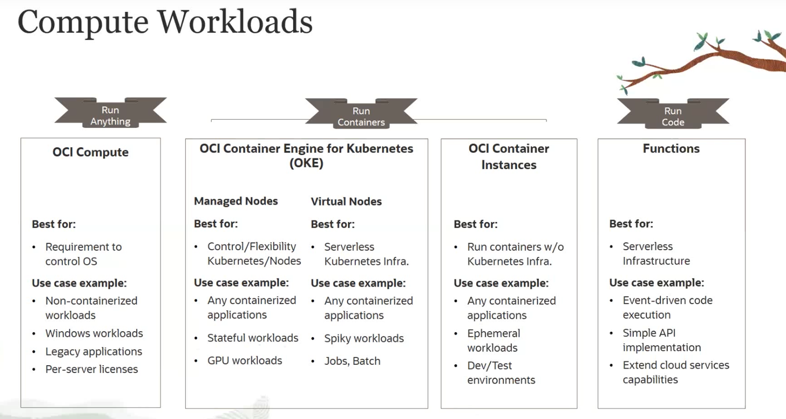
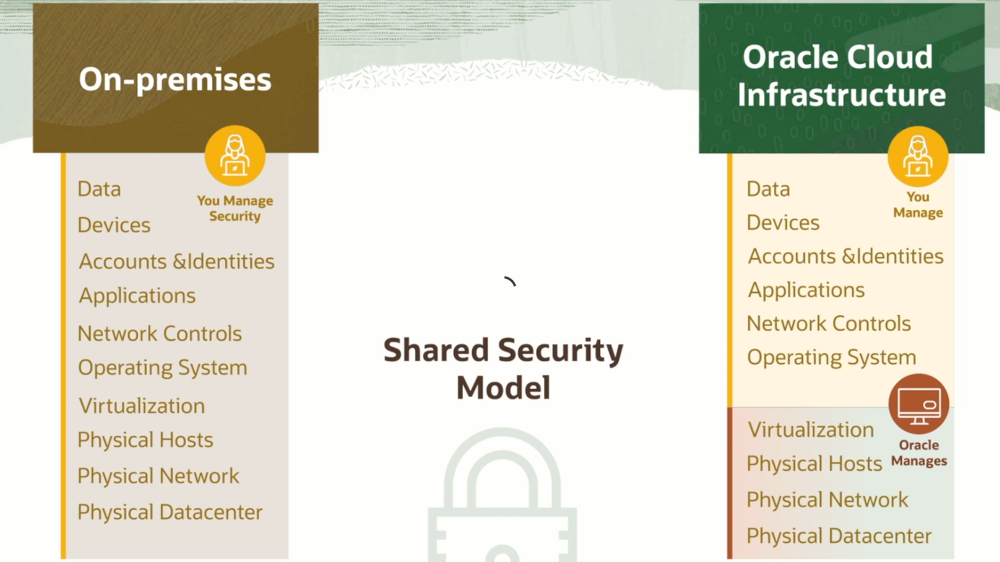
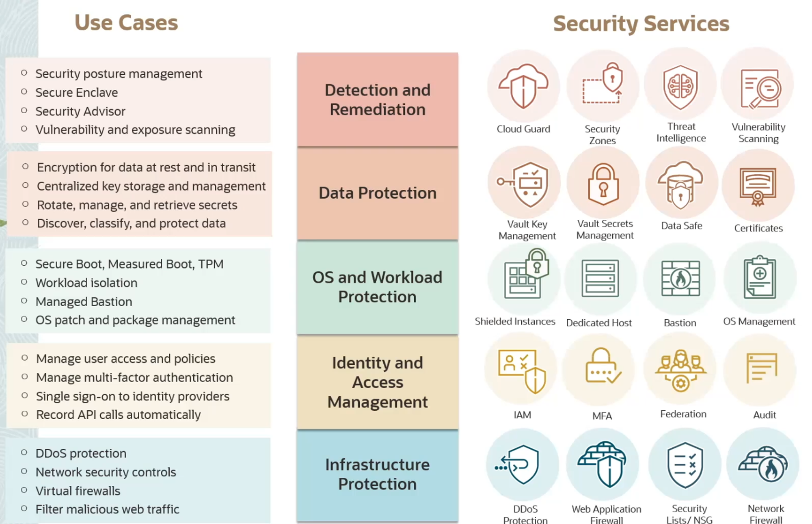
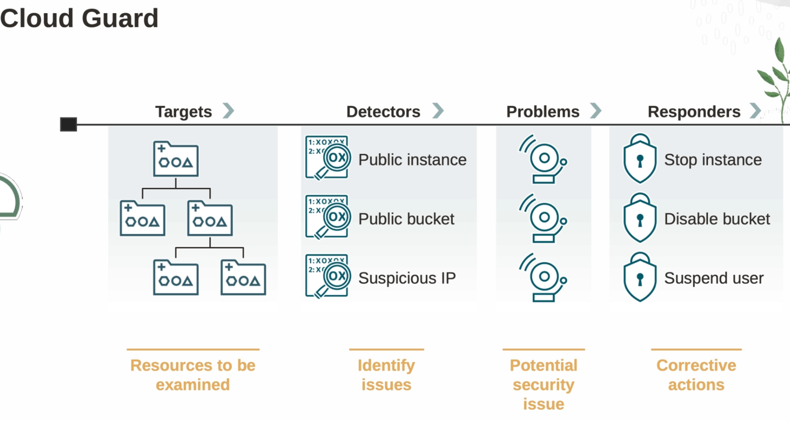
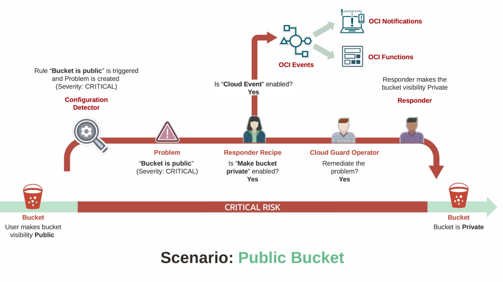
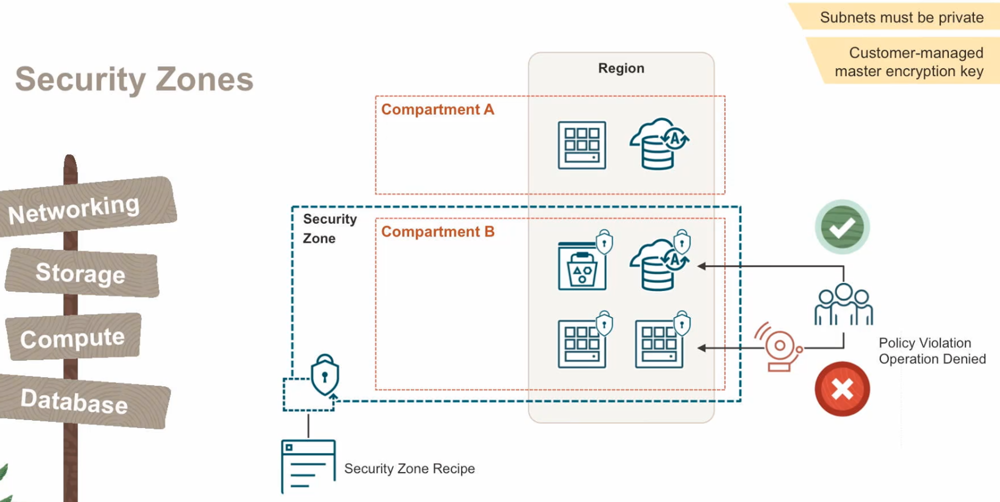
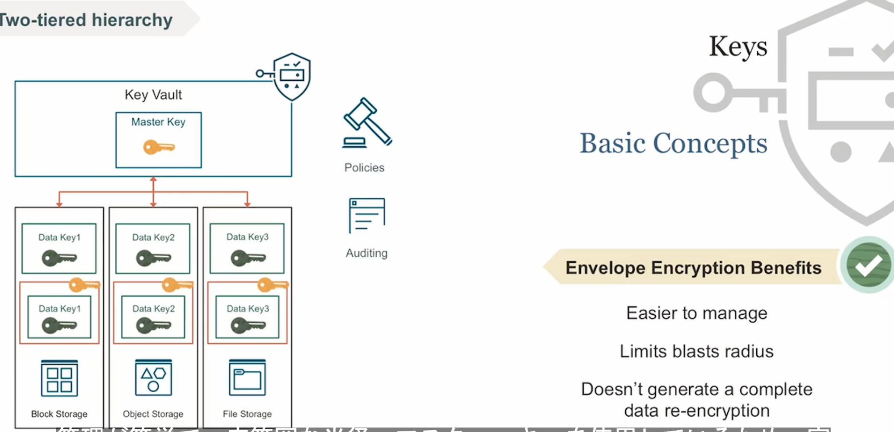

## はじめに

受験の動機と経緯は，所属組織が OCI を利用する可能性があったことと，個人的に OCI の無料枠の魅力を感じたことからです．
Oracle は，DB が強いのはもちろん知っていますが，クラウドサービスとしての使用感や AWS と比較してサービスの網羅性がどうなのか気になっていました．

この，資格試験を受けるために一通り学ぶことで，OCI がどのようなサービスを提供しているのか理解できるようになりました．

## OCI 2023 Foundations Associate とは

> Oracle Cloud Infrastructure 2023 Certified Foundations Associate 認定資格は、Oracle Cloud Infrastructure (OCI) が提供するパブリック・クラウド・サービスの基礎知識があることを証明します。この認定資格は、クラウド・ソリューションの販売や調達に携わるなど、技術的背景を持たない受験者と、コア OCI サービスに関する基礎レベルの知識を検証したい技術的背景を持つ受験者を対象としています。現場経験は不要です。[^1]

[^1]: [OCI 公式ページ](https://education.oracle.com/ja/oracle-cloud-infrastructure-2023-foundations-associate/pexam_1Z0-1085-23)

すなわち，OCI のサービスの概要を理解できていたら合格できる資格試験です．AWS でいう，Cloud Practitioner の位置にあたるものです．

## 筆者のプロフィール

- AWS 保守運用歴 (SRE歴) 1年弱
- AWS SAA 合格から約半年
- OCI は3カ月程度遊んでいる

## 学習方法

Oracle University で Oracle が公式に提供している[学習コンテンツ](https://mylearn.oracle.com/ou/learning-path/become-a-cloud-security-professional-2023/121923)のみです．これ**無料**です！

英語音声のみでしたが，内容が高度でないことと日本語字幕をサポートしているおかげで，容易に学習を進めることができました．

合計学習時間は，座学が 5 時間程度，ハンズオンが 3 時間程度でした．

本番の形式と同じ，模擬テストも提供されているため，しっかり準備することができました．

## 学習時のメモ

以下，学習時のメモを残します．

### OCI Architecture

- Region

  - Availability Domains (AZ)
    - Fault Domains (Logical Data Center within AD). 3 Fault Doamins Per Availability Domains

- 41 Regions
- 12 Azure Interconnect

### OCIU Distributed Cloud

- Cloud@Customer
- OCI - Azure Interconnect
  - No egress or ingress charges for data
  - 帯域幅に対する料金はない
  - OCI で DB, App を Azure などの使い方が便利かも

### IAM

リソースは，OCID で一意に識別される．(AWS での ARN)

フォーマット: `ocid.<RESOURCE TYPE>.<REALM>.[REGION.][FUTURE USE].<UNIQUE ID>`

e.g. `ocid1.instance.oc1.ap-tokyo-1.anxhiljrey55mcqcj7tgzr56eb5mm2uqqhzb6sdnnlfndw5yx365b5fgp3ha`

#### AuthZ (認可)

ポリシーベースの許可

ユーザだけでなく，コンパートメントやテナンシにアタッチすることができる(SCPみたいなの？)

フォーマット: `Allow <group_name> to <verb> <resource_type> in <location> where <condtions>`

- verb

  - `manage`, `use`, `read`, `inspect`

- resource_type

  - object-familyとか

- location
  - compartment

OCI Adminのポリシーの例

```
Allow group OCI-Admin to manage domains in tenancy
Allow group OCI-Admin to manage users in tenancy
Allow group OCI-Admin to manage groups in tenancy
Allow group OCI-Admin to manage dynamic groups in tenancy
Allow group OCI-Admin to manage policies in tenancy
Allow group OCI-Admin to manage compartments in tenancy
...
```

#### IAM 設計のベストプラクティス

- テナンシ管理者アカウントを日常使いするのはやめよう

- リソースをコンパートメントでわけよう

- rootコンパートメントにはリソースを作らないように

- MFAを使おう

### Network

- service gateway

  - VCN からインターネットに出ずに OCI のサービスにアクセスできる
  - AWS でいう VPC Endpoint のようなもの

- Local Peering Gateway (LPG), Dynamic Routing Gateway(DRG)

  - 2つのVCNが同じデータセンタにあるならLPGをせっちすれば，相互に通信が可能になる
  - AWS でいう VPC Peering みたいなもの
  - 異なるデータセンタにある場合は，DRGでOracle backboneを通って通信が可能になる
  - 3つのVCN同士で通信させるなら，DRG v2 を使う
    - それぞれにLPGを置く必要はない

- security list

  - CIDR/ポートでソースと宛先を制限
  - AWS でいう Network ACL みたいなもの

- Network Security Group (NSG)

  - AWS でソースにsgを指定していたような感じの仕組み

- Load Balancer

  - Network Load Balancer

    - L4 TCP & UDP Load Balancer
    - low lantecy

  - HTTP Load Balancer
    - L7
    - HTTP レベルで制御が可能

### Compute

#### VM

- VM インスタンス
  - 複数の顧客がその物理マシンを使用
  - Ampare (arm) とても安い
- Bare Metal インスタンス

  - 専用の物理マシン
  - 高い性能やセキュリティ要件が必要な場合に使う

- インスタンスとネットワークの仕組み

  - Instance は物理的に存在．一方，NW は仮想的．VNIC と Instance の NIC をつなげることでインスタンスが VNC に所属していることになる
  - 

- Live Migrate

  - 再起動せずにホスト間でライブ移行可能
  - 物理メンテを気にしなくてよい

- AutoScaling
  - 無料
  - Config(image, metadata, shapes, vnic, storage, subnet) を使ってオートスケーリングを実現
  - 

#### コンテナ

- OKE

  - k8s
  - portability, lightweight, faster boot が利点

- Container Instance
  - Container Registry や Docker Hub からイメージを取得してコンテナを作れる
  - Fargate のようなコンテナオーケストレーションツールはなく，ただコンテナイメージからインスタンスを作るだけ．
  - 新しいサービスなので機能がまだ少なめ

#### Function

セットアップの手順

1. use Container to Registry
2. Configure Trigger
3. Code runs
4. Pay for Code execution time only

#### Compute まとめ



### Storage

#### Local NVMe

- マシンに紐づいている高速なストレージ

#### File Storage

- 複数インスタンスからマウンっとできる
- ファイルシステム

#### Object Strorage

- (S3)
- オブジェクトは key に対する value (ファイル)で管理 + メタデータ
- バケット名はテナンシでユニーク
- namespace はバケットの top level で global unique である必要がある
- e.g. `https://objectstorage.us-sanjose-1.oraclecloud.com/n/aaaaaaa/b/ccccccccccccc/o/log.zip`

  - このとき `n/aaaaaa` が namespace
  - `b/cccccccccccc` が bucket
  - `o/log.zip` が object

- Infrequent Access Storage (IA)

  - 低頻度アクセス．コストが安い．最小保持期間が31日．アーカイブはもっと安い
  - Auto Tiering可能

- Visibility でパブリックか否か制御できる
  - パブリックは誰でも見れるので好ましくない
  - Pre-Authenticated Request を使用するとよい．署名付きオブジェクトみたいなの？

#### Block Volume

- コンピュートインスタンス のブートボリュームなどに利用
- ネットワーク越しにアクセス
- 別のマシンに付け替えたりといろいろできる

- 持続的で耐久性あり．複製可能．

- Tier

  - Lower Cost (2 IOPS/GB)
  - Balanceed (60)
  - Higher Performance (75)
  - Ultra High Performance(90-225)

- デタッチするとLower cost に自動で変わる．アタッチすると胃是の設定に自動で変わる．
- read/write sharableタイプに設定すると，1つのディスクを複数のVMと共有できる (EBSと異なる)
- デタッチせず，稼働したまま拡張可能
- 非同期で別リージョンにレプリケーション

### DB

- Co-mangaed

  - 責任共有モデルみたい
  - 顧客がデータベースを管理，Oracle がインフラを管理

- Autonomous DB

  - 自己管理, 自己保護, プロビジョニング, Scale-Up, Scale-Out, チューニング, 自動セキュリティパッチ, Fault Tolerance
  - Autonomous Data Warehouse (ADW)
    - 大量データの分析に適したデータウェアハウス
  - Autonomous Transaction Processing (ATP)
    - 少量データのトランザクション処理に適したデータベース
  - Autonomous JSON Database (AJD)
    - JSON 中心のデータに適す．NoSQL
  - (APEX Service)
    - Oracle Application Express
    - 簡易アプリケーション開発

### Security

#### Shared Security Model

Shared Security Model


OCI セキュリティサービス一覧


#### CloudGuard

Cloud Guard 概略図


Cloud Guard が Public Bucket を検知し対応するまでのシナリオの例


#### Security Zone

コンパートメントにアタッチできる SCP みたいなもの．

Security Advisor を使って，パブリックバケットの作成を拒否できたり，コンパートメントのポリシーを管理者が事前に設定できる．
Security Zone を使うには，CloudGuard の有効化が必要．



#### Vault

階層型の鍵管理サービス．

最初に大きな箱 (Vault) を作り，その中に小さな箱を作り，鍵を入れる．

鍵は，共通鍵(AES), 公開鍵暗号(RSA), 署名(ECDSA) を利用可能．



オブジェクトストレージの暗号化鍵にVaultの鍵を使うならポリシーで許可を与える必要がある

e.g. `allow service objectstorage-us-ashbum-1 to use keys in compatment sandbox`

### Cost

どこのリージョンにリソースを作成しても同じ単価．

### Quota

コンパートメントクォータ(Compartment quotas)で特定コンパートメントのリソース使用料をユーザが定義できる．

サービス制限(Service Limits)は Oracle によって設定されるもので，リージョンやテナンシに適応される．
