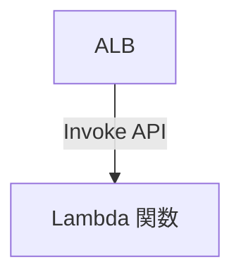

## はじめに

ALB (Application Load Balancer) のターゲットは，インスタンス，IP，Lambda が選択できます．
よく使われるのは，インスタンスか IP であるが，Lambda という選択肢もあり，これを使ったことがなかったため軽く使ってみました．

Lambda をターゲットに選択できるようになったのは，2018 年 11 月かららしいです．かなり昔からある機能なんですね．
https://aws.amazon.com/jp/about-aws/whats-new/2018/11/alb-can-now-invoke-lambda-functions-to-serve-https-requests/

本記事では最小構成での設定手順と，ALB のターゲットに Lambda にする際の特有の注意点 (ヘルスチェック, レスポンスフォーマット) をまとめます．

## 構成

今回は検証用途のため，最低限の構成で試しました．

- VPC
  - Public Subnet * 1
- ALB
- ターゲットグループ
- セキュリティグループ * 2
  - ALB 用
  - Lambda 用
- Lambda 関数
- IAM ロール





### 各リソースの設定

- ALB
    ここは，ターゲットが Lambda だろうが特に変更すべき点なし．

- ターゲットグループ
    ターゲットがインスタンスや IP の場合は，そのプロセスが生きているかチェックするためにヘルスチェックをオンにしておくが基本です．
    しかし，Lambda の場合はインスタンスが常に存在しているわけではないため，オフでもよいように思えます．
    オンにしておくと，ホットスタンバイ状態にできるというメリットがありますが，一定期間ごとに ALB から Lambda が呼び出されます．
    定期的に実行することで，不要なログがたまってしまったり，少量ではありますがコストが微増します．パフォーマンス要件が特別厳しくないのであればオフでもよいでしょう．


- セキュリティグループ
  - ALB 用
    任意のソースから TCP 80 もしくは 443 を許可．これも ALB と同じく Lambda 特有の設定はなし．

  - Lambda 用
    こちらはインバウンドルールは不要．ALB が Lambda の関数 URL に対して HTTP リクエストを投げるのではなく，ALB が Invoke API を使用して呼び出している．
    アウトバウンドルールは，アプリケーションの要件次第．不要なら空っぽでもよい．

- Lambda 関数
    リソースベースポリシーで，ALB からの Invoke を許可する必要があります．
    マネコンから，設定する場合は自動で設定されるが，IaC ツールなどで設定する場合は手動で設定する必要があります．
    以下は例の 1 つ．`Resource` と `AWS:SourceArn` の部分は適宜書き換えること．
    ```json sample Resource-based policy document
    {
      "Version": "2012-10-17",
      "Id": "default",
      "Statement": [
        {
          "Sid": "AWS-ALB_Invoke-targetgroup-lambda-tg-1234567890abcdef",
          "Effect": "Allow",
          "Principal": {
            "Service": "elasticloadbalancing.amazonaws.com"
          },
          "Action": "lambda:InvokeFunction",
          "Resource": "arn:aws:lambda:ap-northeast-1:xxxxxxxx:function:sample-alb-function",
          "Condition": {
            "ArnLike": {
              "AWS:SourceArn": "arn:aws:elasticloadbalancing:ap-northeast-1:xxxxxxxx:targetgroup/lambda-tg/1234567890abcdef"
            }
          }
        }
      ]
    }
    ```


- IAM ロール
    VPC に配置する Lambda に使われるマネージドポリシーの `AWSLambdaVPCAccessExecutionRole` で十分です．
    もし，Resource が `*` を避けたいのであれば，カスタマーマネージドポリシーを書いてもよいですが，`*` でも影響は少ない．

## 実行してみる

Lambda 関数は，以下のようなシンプルな Python コードにしました．
```py
import json

def lambda_handler(event, context):
    print(event)
    print(context)
    return {
        'statusCode': 200,
        'body': json.dumps('Hello from Lambda!')
    }
```

レスポンスのフォーマットは指定されています．
`statusCode` もこんな感じで連想配列に入れて返すことで，Lambda のイベントマッピングが ALB 用に変換してくれます．
また，ここのフォーマットが誤っていると，ALB 側で 502 Bad Gateway が返されます．
https://docs.aws.amazon.com/ja_jp/elasticloadbalancing/latest/application/lambda-functions.html#respond-to-load-balancer
```json
{
    "isBase64Encoded": false,
    "statusCode": 200,
    "statusDescription": "200 OK",
    "headers": {
        "Content-Type": "application/json"
    },
    "body": "Hello from Lambda (optional)"
}
```

まずは，GET リクエストを投げてみました．ちゃんと 200 OK が返ってきました．
`Content-Type` は未指定の場合は，`application/octet-stream` になるようです．JSON を返すことを明示したい場合は，レスポンス時のヘッダに `Content-Type: application/json` が入るよう指定しましょう．
```sh
$ curl "http://public-alb-xxxxxxxxx.ap-northeast-1.elb.amazonaws.com/aaa?a=2" -i
HTTP/1.1 200 OK
Server: awselb/2.0
Date: Sun, 14 Dec 2025 14:32:18 GMT
Content-Type: application/octet-stream
Content-Length: 20
Connection: keep-alive

"Hello from Lambda!"
```

Lambda 関数で受け取ったイベントはこんな感じです．
メソッドやパス，クエリストリング，ヘッダなどがちゃんと渡されているので，Lambda 関数の中で HTTP リクエストに基づいて分岐させることも可能です．
```json
{
    "requestContext": {
        "elb": {
            "targetGroupArn": "arn:aws:elasticloadbalancing:ap-northeast-1:xxxxxxxx:targetgroup/lambda-tg/1234567890abcdef"
        }
    },
    "httpMethod": "GET",
    "path": "/aaa",
    "queryStringParameters": {"a": "2"},
    "headers": {
        "accept": "*/*",
        "host": "public-alb-xxxxxxxxx.ap-northeast-1.elb.amazonaws.com",
        "user-agent": "curl/8.18.0-rc1",
        "x-amzn-trace-id": "Root=1-693ec9fb-4ef0a17b0db1b3fb480f31bc",
        "x-forwarded-for": "192.0.2.1",
        "x-forwarded-port": "80",
        "x-forwarded-proto": "http",
    },
    "body": "",
    "isBase64Encoded": False,
}
```

Context のほうはこんな感じです．SDK ごとにフォーマットは異なりますが，特に面白いのはありません．
```
LambdaContext([aws_request_id=db984996-f8e5-4fd8-a4f2-2b7491ccab44,log_group_name=/aws/lambda/sample-alb-function,log_stream_name=2025/12/14/[$LATEST]0bf60e36a23b4416acfa7fe6e82bfdac,function_name=sample-alb-function,memory_limit_in_mb=128,function_version=$LATEST,invoked_function_arn=arn:aws:lambda:ap-northeast-1:xxxxxxxx:function:sample-alb-function,client_context=None,identity=CognitoIdentity([cognito_identity_id=None,cognito_identity_pool_id=None]),tenant_id=None])
```

x-forwarded-for は適当に名乗っても，それが ALB に伝わります．ALB を使用する際の一般的な挙動と同じです．
やっぱり L3 の情報を L7 に持ってこようとするのが誤っていますね．
[AWS のドキュメント](https://docs.aws.amazon.com/ja_jp/elasticloadbalancing/latest/application/x-forwarded-headers.html)にもセキュリティ上のリスクがあるとしっかり明記されています．

```sh
curl -X POST "http://public-alb-xxxxxxxxx.ap-northeast-1.elb.amazonaws.com/post?a=1" -i \
    -H "x-forwarded-for: 192.0.2.2" \
    -d 'hello=world'
HTTP/1.1 200 OK
Server: awselb/2.0
Date: Sun, 14 Dec 2025 14:36:27 GMT
Content-Type: application/octet-stream
Content-Length: 20
Connection: keep-alive

"Hello from Lambda!"
```

```json
{
    "requestContext": {
        "elb": {
            "targetGroupArn": "arn:aws:elasticloadbalancing:ap-northeast-1:xxxxxxxx:targetgroup/lambda-tg/1234567890abcdef"
        }
    },
    "httpMethod": "POST",
    "path": "/post",
    "queryStringParameters": {"a": "1"},
    "headers": {
        "accept": "*/*",
        "content-length": "11",
        "content-type": "application/x-www-form-urlencoded",
        "host": "public-alb-xxxxxxxxx.ap-northeast-1.elb.amazonaws.com",
        "user-agent": "curl/8.18.0-rc1",
        "x-amzn-trace-id": "Root=1-693ecb6b-09d371942facabea343507dd",
        "x-forwarded-for": "192.0.2.2, 192.0.2.1",
        "x-forwarded-port": "80",
        "x-forwarded-proto": "http",
    },
    "body": "aGVsbG89d29ybGQ=",
    "isBase64Encoded": True,
}
```

## おわりに

今回は，ALB のターゲットに Lambda 関数を指定するアーキテクチャを試してみました．
Lambda の手前に API Gateway を置くことが多く用いられるアーキテクチャですが，API Gateway はタイムアウトの制限があったり，ログの設定やインターナル API を設定しようとすると少々面倒だったりするため，ALB を使う選択肢もあり得ると思います．

既存の ALB を使いまわす場合やメンテナンス時のみ，優先度を変更して Lambda から返すといったケースでは，Lambda をターゲットにするのも選択肢としてあり得るでしょう．
