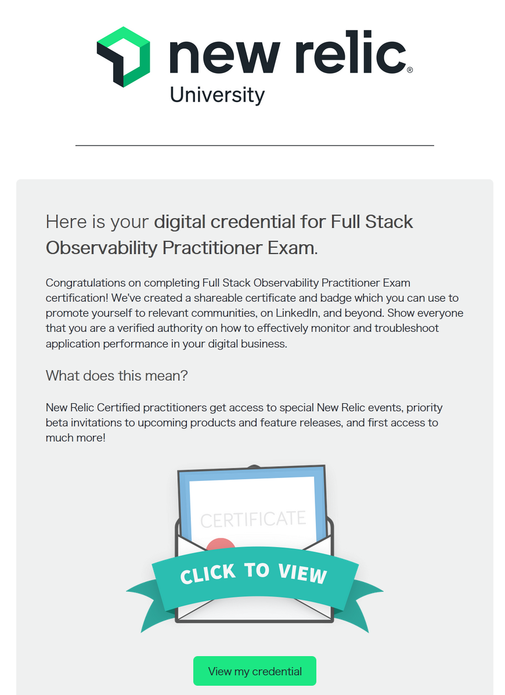

先日メールで New Relic の試験に合格すると T シャツがもらえるよーと案内が来ていました．
なんと，この試験は無料とのことなので，受けてみることにしました．

## New Relic Full-Stack Observability テスト 試験概要

受けてみたのは [Full-Stack Observability テスト](https://learn.newrelic.com/full-stack-observability-exam-jp) というもので，特徴は以下の通りです．

- New Relic について広範な基礎知識が問われる試験
- 無料！
- 80%以上正解で合格
- 制限時間なし
- 5 回まで受験可能で，5 回連続不合格となった場合は，1 ヵ月間受験不可

試験というより，オンラインで力試しできるクイズみたいな感じです．

## 筆者のレベル

新卒 2 年目 SRE で，業務で日常的に New Relic を使用しています．
普段，業務ではダッシュボード作成/閲覧，NRQL 作成，APM 閲覧くらいで，少し Synthetics や Alert 設定をしたことある程度です．
最低限の知識はあるものの，一からの設定はあまりしたことはありません．

主担当ではないものの，最低限 SRE として New Relic の扱えるレベルだと思っています．

## 試験内容

問題は合計 28 問出題され，回答方式は，単一選択，複数選択，穴埋め，左列と右列の選択肢を正しく紐付けるものなどでした．
(穴埋め問題は日本語で答えて大丈夫だったのだろうか？)
レベルとしては基礎レベルで，New Relic の各種機能をある程度用語を理解していれば，だいたい解ける問題でした．
ただ，範囲はほんとに広く，ちゃんと設定値の意味を理解していないとパッと答えられないものもいくつかありました．

## 結果

何の準備もせず挑んでみて，75%．不合格．
前節で，だいたい解けるといいつつも不合格でした．．．
問題の正答は表示されないため，そのまま連続して再挑戦．

2 回目，なんと点数が下がって 71%．またしても不合格．なんで点数下がった？

3 回目，なんとか 82% で合格することができて合格しました．
合格した数分後に以下のようなメールが届きました．

## 感想

連続して 5 回まで受験できる点や，問題が変わらないため，難易度としてはかなり低いです．
ただ，用語の細かい意味や広範な知識を問われると，思ったより難しく，自身が触れていない領域に気づかされました．
また，レベルが低い試験といえども，合格するという経験はモチベ維持につながります．決して無駄じゃないと思っています．

あと T シャツうれしいです．いつ届くんだろう？
