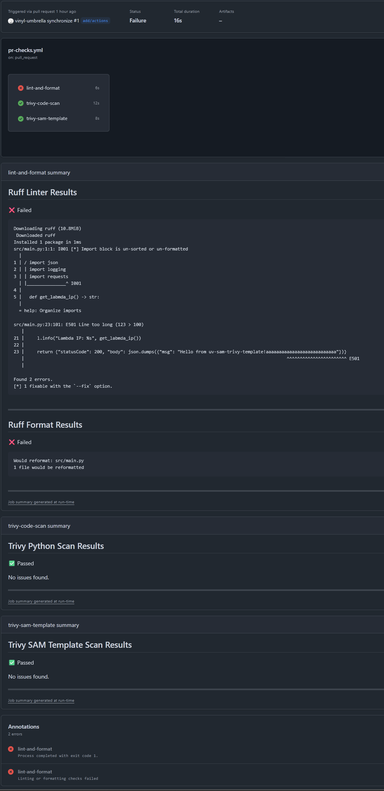
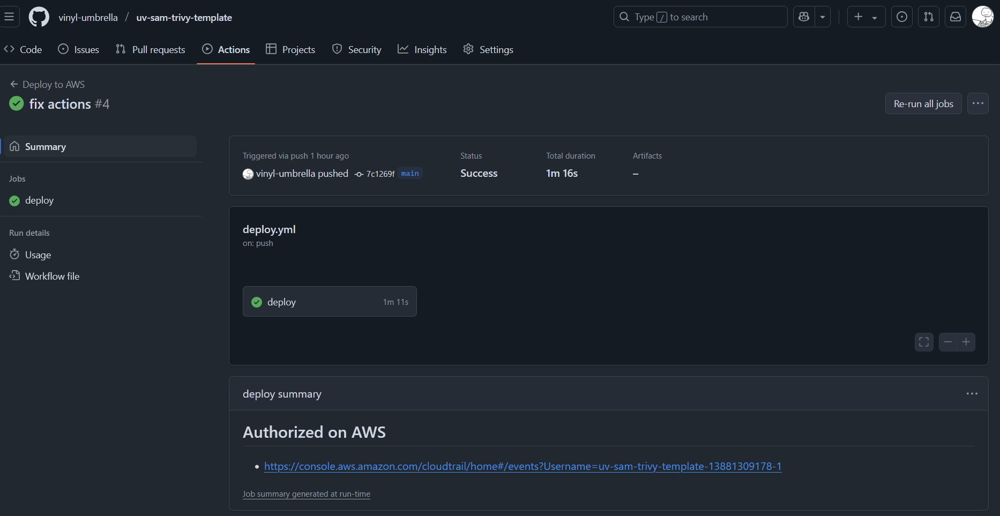

プライベートで簡単なものを作るときは，Python を使って AWS にデプロイすることが多く，そのテンプレとなるリポジトリを作ってみました．

https://github.com/vinyl-umbrella/uv-sam-trivy-template

## 使用ツール

### uv, ruff

Python の開発環境作成には，[uv](https://docs.astral.sh/uv/) を使用しています．
1 年ほど前からすごく話題になっており，Python 開発に用いるツールチェーンを簡単に一括で設定でき，今後の Python 開発の主流になりそうです．
まだ 1.0 に到達しておらず，破壊的変更や機能追加があるため，業務レベルでは扱う気にはなっていませんが，
技術のキャッチアップのために使用しています．

linter の設定は以下のようにしています．

```toml pyproject.toml
[tool.ruff]
line-length = 100
target-version = "py313"
show-fixes = true

[tool.ruff.lint]
select = [
    "E", # pycodestyle errors
    "W", # pycodestyle warnings
    "I", # isort
    "N", # pep8-naming
    "B", # flake8-bugbear
    "C4" # flake8-comprehensions
]
fixable = ["ALL"]
ignore = ["E741"]
```

formatter についても ruff で行えます．
これまで，私は [black](https://black.readthedocs.io/en/stable/) を使用することが多かったですが，
ruff は，black とほぼ同じ出力を出すように意図して作られていると，[公式ドキュメント](https://docs.astral.sh/ruff/formatter/#philosophy)にも記載されているため，uv を使う環境下では，ruff を使っていこうと思っています．

設定は，以下のようにしています．いずれもデフォルト値ですが，デフォルト値が今後変わったとしても，守っておきたいものは明示的に記載しています．

```toml pyproject.toml
[tool.ruff.format]
quote-style = "double"
indent-style = "space"
line-ending = "auto"
skip-magic-trailing-comma = false
```

### AWS SAM

[AWS SAM](https://docs.aws.amazon.com/ja_jp/serverless-application-model/latest/developerguide/what-is-sam.html) は，AWS 純正の IaC ツールで，Lambda を中心としたサーバレスアーキテクチャを構築するのに向いているツールです．
内部的には，ビルド時に CloudFormation テンプレートを作成しており，CloudFormation コンソール画面から作成したスタックを確認できます．

複雑なサービスや，規模の大きいものを作成するのには向いていないですが，個人で使用する分には十分なほどの機能を持っています．

### Trivy

Trivy は，主にコンテナイメージの脆弱性を検出するツールです．
Trivy は，コンテナイメージだけでなく，多くの異なるプラットフォーム，言語，設定ファイルのセキュリティ問題を検出できます．
対応については，[公式ドキュメント](https://trivy.dev/latest/docs/coverage/)に記載されています．

今回の環境では，コンテナイメージのチェック用途ではなく，使用する Python のモジュールに脆弱性がないかや，AWS SAM テンプレートで作成されるリソースに Security Hub で引っかかるものがないかをチェックするために使用しています．
デプロイ前に前述のものをキチンとチェックして問題ないことを確認したいという思いから採用しました．

## CI/CD 環境

### PR 作成時のチェック

今回は一人で作成するだけの環境のため，基本的に PR は main ブランチにしか出しません．
そのため，main をターゲットとした PR 作成のみ，チェックを行うようにしています．

main に入る前にチェックするものは以下の 4 項目です．

- Python のコードで Linter に引っかかっていないか？
- Python のコードで Formatter に引っかかっていないか？
- AWS SAM テンプレートで作成されるリソースに Security Hub で引っかかるものがないか?
- requirements.txt に記載されているパッケージに脆弱性がないか？

Summary に [run の結果 に出力](https://github.com/vinyl-umbrella/uv-sam-trivy-template/actions/runs/13881233027)しているため，改修すべき箇所がすぐにわかるようになっています．
現在は結果を Summary に出力しています．(理想は，PR にて，コードに対してコメントするところまで自動化でしたかったです...)

<details><summary>run の結果のサンプル</summary>



</details>

### main にマージ時

AWS SAM でデプロイします．

「GitHub CI/CD 実践ガイド」の著者が書いた[記事](https://zenn.dev/tmknom/articles/traceable-github-actions-with-aws)を参考に，トレーサビリティを考慮した GitHub Actions の設定にしています．

```yaml deploy.yml
jobs:
  deploy:
    # ...省略...
    steps:
      # ...省略...

      # セッション名は `{リポジトリ名}-{GitHub Actions の実行 ID}-{GitHub Actions の実行試行回数}` としている
      - name: Generate session name
        id: session
        run: |
          repo="${GITHUB_REPOSITORY#${GITHUB_REPOSITORY_OWNER}/}"
          echo "name=${repo}-${GITHUB_RUN_ID}-${GITHUB_RUN_ATTEMPT}" >> "${GITHUB_OUTPUT}"

      # AWS にアクセス時に全ステップで生成したセッション名をセットして，short-term credentials を使用
      - name: Setup AWS credentials
        uses: aws-actions/configure-aws-credentials@v4
        with:
          aws-region: ${{ secrets.AWS_REGION }}
          role-to-assume: ${{ secrets.IAM_ROLE_ARN }}
          role-session-name: ${{ steps.session.outputs.name }}

      # summary に CloudTrail の URL を出力
      - name: Output step summary
        env:
          SESSION_NAME: ${{ steps.session.outputs.name }}
          CLOUDTRAIL_URL: https://console.aws.amazon.com/cloudtrail/home#/events
        run: |
          echo "## Authorized on AWS" >> "${GITHUB_STEP_SUMMARY}"
          echo "- ${CLOUDTRAIL_URL}?Username=${SESSION_NAME}" >> "${GITHUB_STEP_SUMMARY}"
      # ...省略...
```


