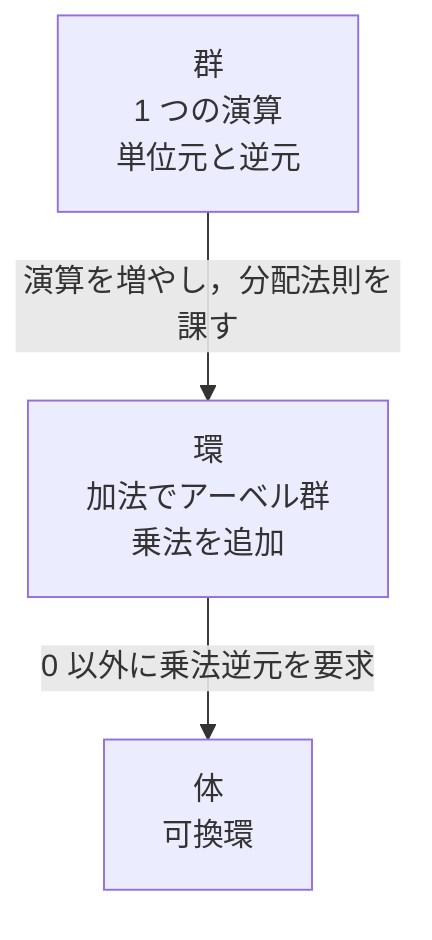
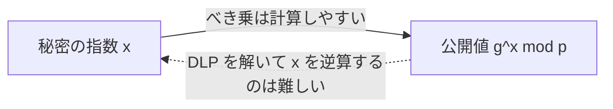

最近業務で暗号に触れる機会があり，改めて専攻していた暗号について学びなおしました．
IT エンジニアはもちろん，計算機科学を専攻している人でも，暗号をしっかり学んだことがある人は少ないのではないでしょうか？
そこで，私の復習のためにも，基礎から暗号の仕組みを執筆しようと思います．

本シリーズは，HTTPS や SSH，Web API の署名検証のような，Web エンジニアにも身近な題材に繋げながら進めます．

本シリーズでは，抽象代数学の基礎から始まり，最終的に TLS や SSH といった身近なプロトコルの仕組みまでを段階的に解説します．
本稿は，暗号学を語るうえでの予備知識として，抽象代数学の基礎を解説します．

<details>
<summary>シリーズ目次</summary>

1. **抽象代数学の基礎** (本稿)
2. 楕円曲線
3. DH 鍵共有，ECDH 鍵共有
4. 共通鍵暗号 (AES など)
5. 公開鍵暗号 (RSA, ECC など)
6. TLS
7. (余談) SSH

(失踪したらごめんなさい．)
</details>

## はじめに

暗号アルゴリズムの多くは，数学的な構造の上に成り立っています．
たとえば RSA は「大きな数の素因数分解が困難である」という性質を利用しますし，楕円曲線暗号は「楕円曲線上の離散対数問題が困難である」ことに依拠しています．

これらを理解するために，まずは抽象代数学の基本的な概念を押さえる必要があります．
本稿では，群・環・体という代数的構造を定義し，それがどのように暗号に繋がるかを説明します．

## 集合と二項演算

抽象代数学では，集合とその上の演算を組み合わせて代数的構造を定義します．
二項演算とは，集合 $S$ の 2 つの要素を受け取り，1 つの要素を返す演算のことです．
たとえば，整数の集合 $\mathbb{Z}$ 上の加法 $+$ は二項演算です．任意の整数 $a, b$ に対して $a + b$ もまた整数になります．
この「演算の結果が同じ集合に属する」性質を閉包性 (closure) と呼びます．

## 群

群は，抽象代数学で最も基本的な構造です．

### 定義

集合 $G$ と二項演算 $\cdot$ の組 $(G, \cdot)$ が群であるとは，以下の 4 つの条件を満たすことをいいます．

1. **閉包性**: 任意の $a, b \in G$ に対して，$a \cdot b \in G$
2. **結合法則**: 任意の $a, b, c \in G$ に対して，$(a \cdot b) \cdot c = a \cdot (b \cdot c)$
3. **単位元の存在**: ある $e \in G$ が存在して，任意の $a \in G$ に対して $e \cdot a = a \cdot e = a$
4. **逆元の存在**: 任意の $a \in G$ に対して，ある $b \in G$ が存在して $a \cdot b = b \cdot a = e$

さらに，可換法則 (任意の $a, b \in G$ に対して $a \cdot b = b \cdot a$) も満たす群を アーベル群 (可換群) と呼びます．

### 例: 整数の加法群

整数全体の集合 $\mathbb{Z}$ と加法 $+$ の組 $(\mathbb{Z}, +)$ は群です．

- 閉包性: 整数同士の和は整数
- 結合法則: $(a + b) + c = a + (b + c)$
- 単位元: $0$($a + 0 = 0 + a = a$)
- 逆元: $a$ の逆元は $-a$($a + (-a) = 0$)
- 可換法則も成り立つので，アーベル群

### 例: 剰余群 ℤ/nℤ

整数を $n$ で割った余りの集合 $\{0, 1, 2, \ldots, n-1\}$ に加法 ($\bmod\ n$) を定義したものを剰余群 $\mathbb{Z}/n\mathbb{Z}$ と書きます．

たとえば $\mathbb{Z}/5\mathbb{Z} = \{0, 1, 2, 3, 4\}$ では，$3 + 4 \equiv 2 \pmod{5}$ のように計算します．

この群は有限群であり，暗号で非常に重要な役割を果たします．

<details>
<summary>☕ コラム: 暗号学者と抽象代数学</summary>

「暗号を学ぶのに，なぜ代数学が必要なのか？」と思うかもしれません．歴史的に，現代暗号学が本格的に発展したのは 1970 年代の Diffie-Hellman 鍵交換や RSA の発明からですが，これらはすべて数論や代数学の成果の上に成り立っています．


暗号の安全性は「ある数学的問題が計算困難であること」に依存しており，その問題を正確に定義するために抽象代数学の言葉が不可欠なのです．逆に言えば，この章を理解すれば，後続の章で「なぜこのアルゴリズムが安全なのか」を明確に理解できるようになります．

最近では，量子コンピュータの登場に伴い，従来の暗号の安全性を担保するための問題が解かれてしまう可能性が指摘されており，耐量子暗号 (PQC) の研究がおこなわれています．
</details>

## 環 (Ring)

群に「もうひとつの演算」を加えた構造が環です．

### 定義

集合 $R$ と 2 つの二項演算 $+$ (加法) と $\times$ (乗法) の組 $(R, +, \times)$ が環であるとは，以下の条件を満たすことをいいます．

1. $(R, +)$ がアーベル群
2. 乗法の結合法則: 任意の $a, b, c \in R$ に対して $(a \times b) \times c = a \times (b \times c)$
3. 分配法則: $a \times (b + c) = (a \times b) + (a \times c)$ かつ $(a + b) \times c = (a \times c) + (b \times c)$

乗法の単位元 (1 に相当する要素) が存在する環を単位的環と呼びます．
さらに乗法が可換であれば可換環と呼びます．

### 例: 整数環 ℤ

整数全体の集合 $\mathbb{Z}$ は，加法と乗法に関して可換環です．

- $(\mathbb{Z}, +)$ はアーベル群
- 乗法の結合法則，分配法則を満たす
- 乗法の単位元 1 が存在
- 乗法は可換

ただし，$0$ 以外の整数すべてに乗法の逆元があるわけではありません (たとえば，$2$ の乗法における逆元 $1/2$ は整数ではない)．
これが，環と次に紹介する「体」の違いです．

## 体 (Field)

### 定義

集合 $F$ と 2 つの二項演算 $+$，$\times$ の組 $(F, +, \times)$ が体であるとは，以下の条件を満たすことをいいます．

1. $(F, +, \times)$ が可換環
2. 乗法の単位元 $1$ が存在し，$1 \neq 0$
3. **0 以外の** 任意の要素に乗法の逆元が存在

つまり，体は「四則演算 (0 による除算を除く) が自由にできる」代数的構造です．

### 例: 有理数体 ℚ，実数体 ℝ

有理数 $\mathbb{Q}$ や実数 $\mathbb{R}$ は体です．任意の非零要素に対して逆数が存在します．
一方，整数 $\mathbb{Z}$ は体ではありません．たとえば $2$ の乗法における逆元 $1/2$ は整数ではないためです．
群・環・体は，条件を積み増していくイメージで捉えると，次のようになります．



### 有限体 GF(p)

暗号で最も重要な体が有限体 (ガロア体) です．

素数 $p$ に対して，集合 $\{0, 1, 2, \ldots, p-1\}$ 上で加法と乗法を $\bmod\ p$ で行ったものを $\mathrm{GF}(p)$ と書きます (GF は Galois Field の略)．
たとえば $\mathrm{GF}(7) = \{0, 1, 2, 3, 4, 5, 6\}$ では，次のようになります．

- 加法: $3 + 5 \equiv 1 \pmod{7}$
- 乗法: $3 \times 5 \equiv 1 \pmod{7}$

ここで $3 \times 5 \equiv 1 \pmod{7}$ であることから，$\mathrm{GF}(7)$ における $3$ の乗法逆元は $5$ であることがわかります．

$p$ が素数であることが重要で，$p$ が素数のとき，$0$ 以外のすべての要素に乗法の逆元が存在することが保証されます (体の条件を満たす)．

<details>
<summary>☕ コラム: 有限体の表記 GF(p) と 𝔽ₚ</summary>

有限体は「$\mathrm{GF}(p)$」(Galois Field) と書く流儀と「$\mathbb{F}_p$」と書く流儀があります．$\mathrm{GF}(p)$ は工学寄りの文脈で多く使われ，$\mathbb{F}_p$ は数学寄りの文脈で好まれます．本シリーズでは RFC や NIST の文書に合わせて $\mathrm{GF}(p)$ を使いますが，論文を読む際には $\mathbb{F}_p$ も同じものだと覚えておくとよいでしょう．

</details>

## 剰余演算とモジュロ算術

暗号計算のほとんどはモジュロ算術 (mod 演算) の世界で行われます．

### 合同式

整数 $a, b$ と正の整数 $n$ に対して，$a - b$ が $n$ で割り切れるとき，$a \equiv b \pmod{n}$ と書き，「$a$ と $b$ は $n$ を法として合同」といいます．

### 基本的な性質

モジュロ算術では，以下の性質が成り立ちます．

$$
(a + b) \bmod n = ((a \bmod n) + (b \bmod n)) \bmod n
$$

$$
(a \times b) \bmod n = ((a \bmod n) \times (b \bmod n)) \bmod n
$$

この性質のおかげで，非常に大きな数の計算でも途中で mod を取りながら計算でき，計算量を抑えることができます．

この「一定の範囲で値が折り返す」感覚は，時計の時刻計算や，配列インデックスをリング状に扱う実装に近いです．
暗号では，この折り返しが偶然ではなく，数学的に厳密なルールとして使われます．

### フェルマーの小定理

$p$ を素数，$a$ を $p$ と互いに素な整数とするとき，次が成り立ちます．

$$
a^{p-1} \equiv 1 \pmod{p}
$$

が成り立ちます．これは $\mathrm{GF}(p)$ の乗法群の位数が $p - 1$ であることの帰結です．

この定理は，モジュロ逆元の計算や，素数体上のべき乗計算の性質を理解する際に直接役立ちます．
RSA では，より一般にはオイラーの定理や中国剰余定理のほうが本筋です．

### 拡張ユークリッドの互除法

2 つの整数 $a, b$ の最大公約数 $\gcd(a, b)$ を求めるだけでなく，$ax + by = \gcd(a, b)$ を満たす整数 $x, y$ も同時に求めるアルゴリズムです．

$\gcd(a, n) = 1$ のとき，$ax \equiv 1 \pmod{n}$ となる $x$ (モジュロ逆元) を求めることができます．

Go 言語で拡張ユークリッドの互除法のサンプルコードを示すと，次のようになります．

```go
func ExtendedGCD(a, b int) (gcd, x, y int) {
    if b == 0 {
        return a, 1, 0
    }
    gcd, x1, y1 := ExtendedGCD(b, a % b)
    x = y1
    y = x1 - (a / b) * y1
    return gcd, x, y
}
```

## 巡回群と生成元

### 巡回群

群 $G$ のある要素 $g$ が存在して，$G$ のすべての要素が $g$ の累乗で表せるとき，$G$ を巡回群と呼び，$g$ を $G$ の生成元と呼びます．

$$
G = \{g^0, g^1, g^2, \ldots, g^{n-1}\}
$$

ここで $g^n = e$，$n$ は群の位数です．

### GF(p) の乗法群

$\mathrm{GF}(p)$ から $0$ を除いた集合 $\mathrm{GF}(p)^* = \{1, 2, \ldots, p-1\}$ は，乗法に関して位数 $p - 1$ の巡回群になります．
たとえば $\mathrm{GF}(7)^* = \{1, 2, 3, 4, 5, 6\}$ は位数 $6$ の巡回群で，$3$ が生成元のひとつです．

- $3^1 \equiv 3 \pmod{7}$
- $3^2 \equiv 2 \pmod{7}$
- $3^3 \equiv 6 \pmod{7}$
- $3^4 \equiv 4 \pmod{7}$
- $3^5 \equiv 5 \pmod{7}$
- $3^6 \equiv 1 \pmod{7}$

$3$ の累乗で $\{1, 2, 3, 4, 5, 6\}$ のすべてが生成されていることがわかります．

この巡回群の構造が，Diffie-Hellman 鍵交換の基盤になります．

## 離散対数問題 (DLP)

ここまでが，暗号を語るうえで必要な抽象代数学の基礎です．
ようやく暗号の安全性の根拠のひとつである離散対数問題 (DLP) を説明できるようになりました．

### 定義

巡回群 $G$ において，生成元 $g$ と要素 $h \in G$ が与えられたとき，$h = g^x$ を満たす $x$ を求める問題を離散対数問題 (Discrete Logarithm Problem, DLP) と呼びます．

有限体 $\mathrm{GF}(p)^*$ の文脈では，これは次のように書けます．

$$
g^x \equiv h \pmod{p}
$$

と書けます．

### なぜ「困難」なのか

通常の対数 (実数上の log) は簡単に計算できますが，有限群上の離散対数には，実用上，十分高速な一般解法が知られていません．

具体的には次の通りです．
- **べき乗の計算は容易**: $g^x \bmod p$ は，繰り返し二乗法を使えば $O(\log x)$ 回の乗算で計算可能
- **逆方向は困難**: $h$ が与えられたとき $x$ を求めるには，$p$ が十分大きければ現実的な時間では解けない

図にすると，「前向きの計算はしやすいが，逆向きは難しい」という非対称性があります．



この一方向性 (計算は簡単だが逆算は困難) が，暗号の安全性の根拠になります．

たとえば Diffie-Hellman 鍵交換では，公開される値 $g^a \bmod p$ から秘密の値 $a$ を復元することが DLP に帰着され，これが困難であるために安全性が担保されます．

### 計算量

有限体 $\mathrm{GF}(p)^*$ 上の DLP には，数体篩法のような準指数時間アルゴリズムが知られています．
そのため，有限体 DH では十分大きな素数が必要です．
[NIST SP 800-57](https://nvlpubs.nist.gov/nistpubs/SpecialPublications/NIST.SP.800-57pt1r5.pdf) では，有限体暗号の 2048 ビットはおおむね 112 ビット，3072 ビットはおおむね 128 ビット相当の強度として扱われます．

<details>
<summary>☕ コラム: 暗号強度を示す「xxx ビット相当」とは何か</summary>

鍵長と暗号強度は 1 対 1 ではありません．
ここでいう「112 ビット」「128 ビット」は，有限体の素数が 112 ビットや 128 ビットであるという意味ではありません．
「その暗号を破るために必要な計算量を，共通の物差しで表した値」だと思うと分かりやすいです．

ざっくりいうと，112 ビット相当の強度は「最善の既知の古典攻撃でも，おおむね $2^{112}$ 程度の計算量が必要」という意味です．
128 ビット相当も同様に，おおむね $2^{128}$ 程度の計算量を要する強度を指します．

共通鍵暗号では 128 ビット鍵がおおむね 128 ビット強度に対応しますが，RSA や有限体 DH では最良攻撃が総当たりではないため，128 ビット強度を得るのに 3072 ビット級のパラメータが必要になります．

同じ感覚で見ると，おおむね次のように対応します．

| 方式            | おおむね 112 ビット強度 | おおむね 128 ビット強度 |
| --------------- | ----------------------: | ----------------------: |
| 有限体 DH / RSA |             2048 ビット |             3072 ビット |
| 楕円曲線暗号    |            224 ビット級 |            256 ビット級 |
| 共通鍵暗号      |            112 ビット級 |            128 ビット級 |

NIST SP 800-57 は，このような「セキュリティ強度」の考え方で鍵長を整理しています．
また，日本では CRYPTREC も「暗号強度要件 (アルゴリズム及び鍵長選択) に関する設定基準」で，同様の考え方に基づいて鍵長選択の基準を示しています．

そのため，実務では「RSA-2048 か RSA-3072 か」を単体で見るより，「必要なのは 112 ビット強度か，128 ビット強度か」という順番で考えるほうが整理しやすいです．

</details>

## まとめ

本稿では，暗号学の基盤となる抽象代数学の概念を整理しました．

| 構造 | 演算       | 主な条件                                     |
| ---- | ---------- | -------------------------------------------- |
| 群   | 1つ        | 閉包性・結合法則・単位元・逆元               |
| 環   | 2つ (+, ×) | 加法がアーベル群 + 乗法の結合法則 + 分配法則 |
| 体   | 2つ (+, ×) | 環 + 非零要素の乗法逆元                      |

暗号で特に重要なポイントは以下の通りです．

- **有限体 $\mathrm{GF}(p)$**: 暗号計算の舞台となる有限の世界
- **巡回群と生成元**: Diffie-Hellman 鍵交換や楕円曲線暗号の基盤
- **離散対数問題**: 暗号の安全性を支える計算困難な問題

次回は，この代数的構造の上に構築される楕円曲線について説明します．
TLS や SSH でよく見かける X25519 や P-256 が，なぜ短い鍵長で高い安全性を出せるのかが見えるようになります．

---

#### 参考文献

- [NIST SP 800-186: Recommendations for Discrete Logarithm-based Cryptography](https://csrc.nist.gov/pubs/sp/800/186/final) — 離散対数ベースの暗号に関する NIST の推奨事項
- [NIST SP 800-57 Part 1 Rev.5: Recommendation for Key Management](https://csrc.nist.gov/pubs/sp/800/57/pt1/r5/final) — 鍵長の推奨値
- [CRYPTREC LS-0003-2022R1: 暗号強度要件 (アルゴリズム及び鍵長選択) に関する設定基準](https://www.cryptrec.go.jp/list/cryptrec-ls-0003-2022r1.pdf) — 電子政府向けの暗号強度と鍵長選択の基準
- 雪江明彦『代数学 1 群論入門』日本評論社 — 群・環・体の厳密な定義と証明
- Alfred J. Menezes, Paul C. van Oorschot, Scott A. Vanstone, "Handbook of Applied Cryptography", CRC Press — 応用暗号学の包括的リファレンス
